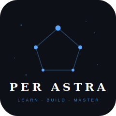

<p align="center">
  
</p>

<h1 align="center">Per Astra</h1>

<p align="center">
  Duolingo-style interactive lessons for mastering Claude, prompt engineering,<br>
  and the Anthropic AI stack — free, offline, and built for developers.
</p>

<p align="center">
  
  &nbsp;
  
  &nbsp;
  
</p>

---

Per Astra — from *per aspera ad astra*, through hardship to the stars — is a Flutter mobile app that teaches developers to use Claude AI and the Anthropic stack through short, gamified daily exercises. Each lesson is a focused challenge: write a better prompt, apply chain-of-thought reasoning, build a few-shot example, or structure a Claude API call. Complete lessons to earn XP, maintain streaks, unlock badges, and earn certifications — entirely offline, no account required.

## Features

- **Interactive lesson player** — multiple-choice and write-your-own-prompt exercises
- **Skill tree** — visual curriculum from Prompt Fundamentals to API Integration and Tool Use
- **Gamification** — XP, levels, daily streaks with a freeze mechanic, badges, and certificates
- **Offline-first** — all content is bundled in the app; no internet required after install
- **No account required** — progress lives on-device in a local SQLite database

## Curriculum

| Module | Topics covered |
|---|---|
| Prompt Fundamentals | Prompt structure, clarity, XML tags, role of context |
| Role Prompting and Few-Shot | Role assignment, few-shot examples, output format control |
| Chain-of-Thought and Extended Thinking | Step-by-step reasoning, self-consistency techniques |
| API Integration and Tool Use | Claude API calls, tool definitions, structured output |

## Tech stack

| Layer | Choice | Decision |
|---|---|---|
| Framework | Flutter 3 (iOS + Android) | — |
| State management | Riverpod 3 + flutter\_hooks | [ADR-001](docs/adr/ADR-001-state-management.md) |
| Persistence | Drift / SQLite (on-device) | [ADR-002](docs/adr/ADR-002-backend-and-data.md) |
| Navigation | go\_router | [ADR-004](docs/adr/ADR-004-navigation.md) |
| Content | JSON assets under `assets/content/` | [ADR-005](docs/adr/ADR-005-content-format.md) |

All architectural decisions are documented in [`docs/adr/`](docs/adr/).

## Getting started

```sh
flutter pub get
dart run build_runner build --delete-conflicting-outputs
flutter test
flutter run
```

Requires Flutter SDK with Dart ≥ 3.12. No backend setup or API keys needed — the app runs entirely on-device.

## Status

v1 Foundation is in active development. See [`ROADMAP.md`](ROADMAP.md) and [`PRD.md`](PRD.md) for planned milestones and the full feature backlog.

## License

No license has been chosen yet. Some lesson content is derived from Anthropic's Apache-2.0-licensed [courses repository](https://github.com/anthropics/courses); the final license selection will account for that dependency.

---

## GitHub topics

Add these under **Settings → Topics** to maximize search discoverability
(aim for 10–15; GitHub search matches topics exactly):

`flutter` `dart` `mobile` `claude-ai` `anthropic` `prompt-engineering` `ai-learning` `gamification` `education` `riverpod` `drift` `sqlite` `ios` `android` `offline-first`
